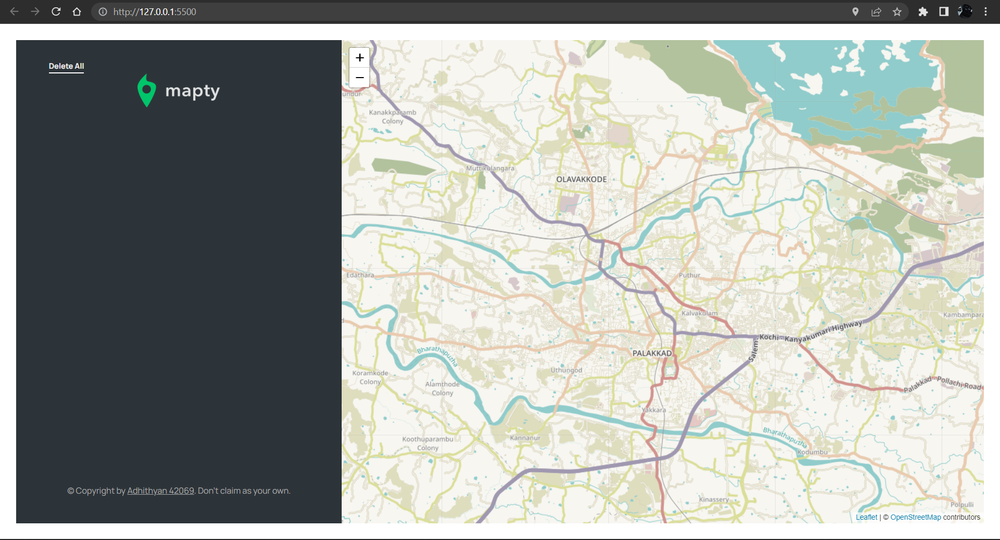
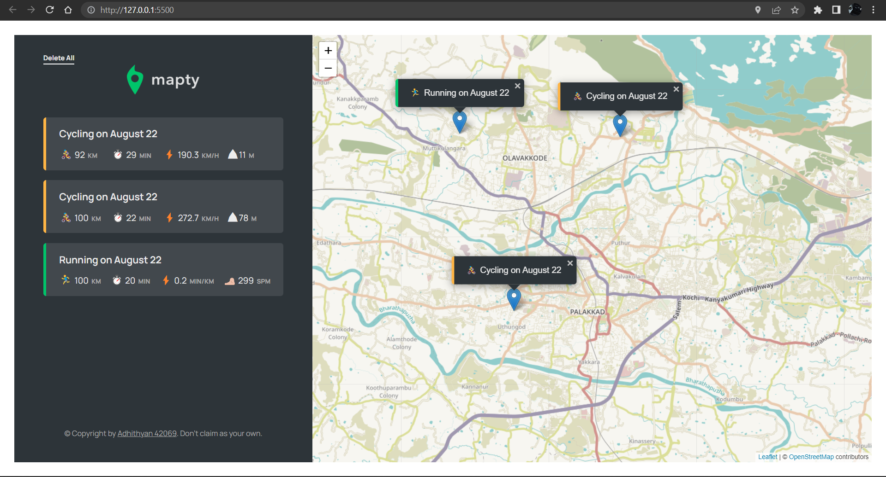

# Mapty

An advanced frontend project

<h4>functions:<h4>
<ul>
    <li><b>will open the map with user's current geolocation which is taken from chrome api<b> </li>
    <li><b>Can use to mark down cycling or walking path with some maths functions!<b> </li>
</ul>
